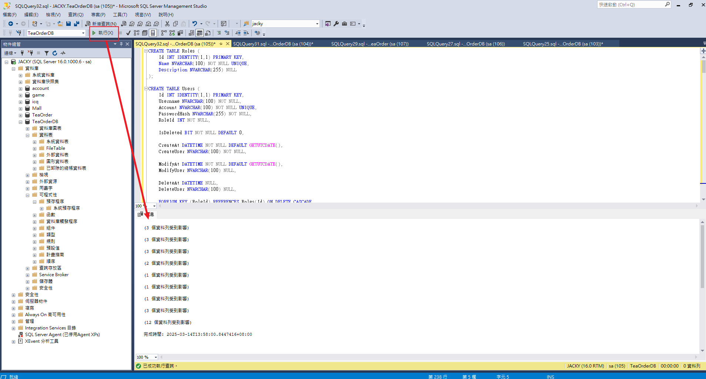
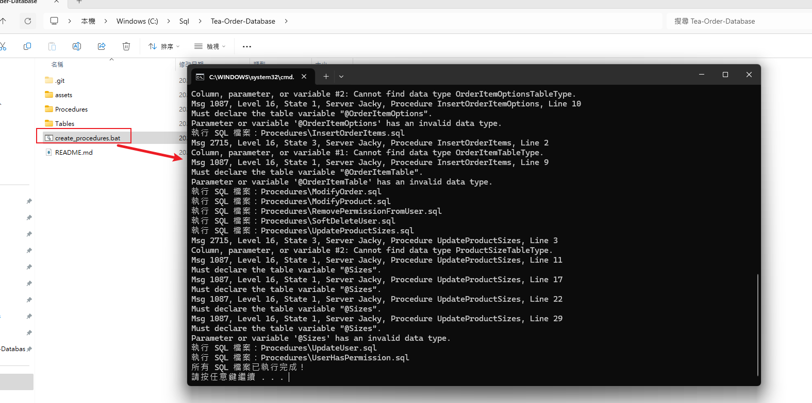
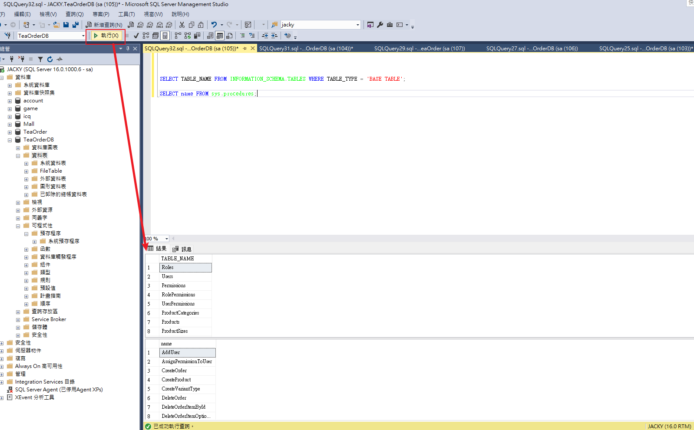

# Tea-Order-Manage-Database

本專案包含 `TeaOrderDB` 的 **資料表 (`Tables`)** 及 **儲存過程 (`Stored Procedures`)**，請按照以下步驟建立資料庫。

---

## 1️⃣ 創建資料庫 `TeaOrderDB`
請先在 SQL Server 內創建 `TeaOrderDB`，可以使用 SSMS (SQL Server Management Studio) 或執行以下 SQL：

```sql
CREATE DATABASE TeaOrderDB;
GO
USE TeaOrderDB;
```

---

## 2️⃣ 執行資料表 (`TeaTable.sql`)
請打開 `script` 資料夾，執行 `TeaTable.sql` 來建立所有資料表。

🔹 **使用 SSMS 執行**
1. 在 **SQL Server Management Studio (SSMS)** 內開啟 `TeaTable.sql`。
2. 選擇 `TeaOrderDB` 作為當前資料庫。
3. 點擊 **執行 (Execute)** 來創建表。


---

## 3️⃣ 執行 `Procedures` 內所有 SQL 檔案
請使用 `create_procedures.bat` 來批次執行 `Procedures` 資料夾內的所有 `.sql` 檔案，以建立所需的 **Stored Procedures (儲存過程)**。

🔹 **使用批次檔 `create_procedures.bat` 自動執行**
1. 確保所有 `Stored Procedure` 的 `.sql` 檔案位於 `Procedures` 資料夾內。
2. 直接執行 `create_procedures.bat`，或在 `CMD` 中輸入：
   ```sh
   create_procedures.bat
   ```
3. 批次檔將會自動遍歷 `Procedures` 資料夾內的所有 `.sql` 檔案，並依序執行。
4. 如果有錯誤，請檢查 `TeaOrderDB` 是否已正確建立，並確保 `Stored Procedure` 的語法正確。

🔹 **手動執行（如果不使用批次檔）**
1. 在 **SQL Server Management Studio (SSMS)** 內打開 `Procedures` 資料夾的所有 `.sql` 檔案。
2. 確保當前資料庫已選擇 `TeaOrderDB`。
3. 依序執行所有 SQL 檔案。

🚀 **使用 `create_procedures.bat`，可以更快速自動化建立 `Stored Procedures`，無需手動執行每個檔案！**


---

## 4️⃣ 確認資料庫是否正確創建
可以使用以下 SQL 檢查 `TeaOrderDB` 是否包含所有資料表和存儲過程：

```sql
--查詢所有資料表
SELECT TABLE_NAME FROM INFORMATION_SCHEMA.TABLES WHERE TABLE_TYPE = 'BASE TABLE';

--查詢所有儲存過程
SELECT name FROM sys.procedures;
```

執行後，如果看到所有必要的表和存儲過程，則表示 `TeaOrderDB` 設定成功！

---

## 🚀 完成後，你可以連接 `TeaAPI`
請確保 `TeaAPI` 專案的 `appsettings.json` 內的 `ConnectionStrings` 已經正確指向 `TeaOrderDB`，例如：

```json
"ConnectionStrings": {
  "DefaultConnection": "Server=YOUR_SERVER;Database=TeaOrderDB;User Id=YOUR_USER;Password=YOUR_PASSWORD;TrustServerCertificate=True;"
}
```

完成後，你的 `TeaOrderDB` 已經準備好使用！🚀🎯

---

## 🔹 Tea API 參考
若需要 API 端的實作，請參考 **[Tea-Order-Manage-API](https://github.com/Jacky0624/Tea-Order-Manage-API)**。

